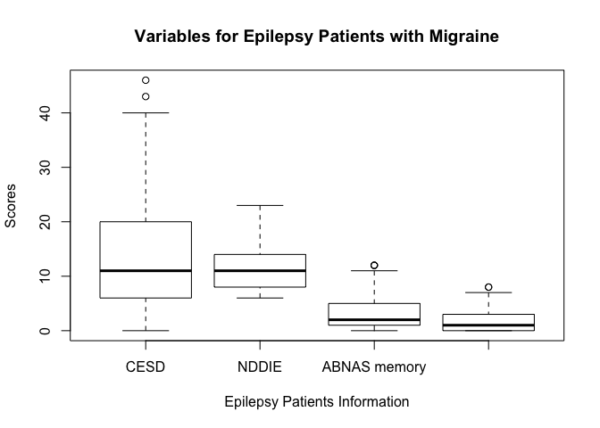
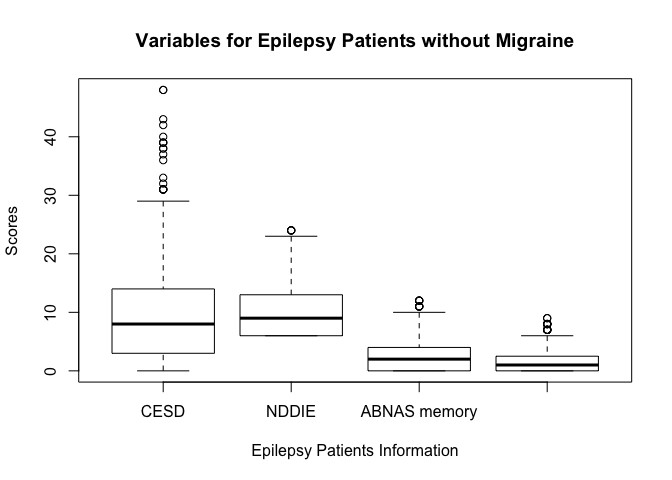

Biostats\_Methods\_hw1
================
Yishan Wang
2018-9-24

Problem 1
=========

The name of the story I found online is called **"Lung Cancer Screening Most Beneficial for Those at Highest Risk, Analysis Suggests"**. The similar stories were reported in several media outlet, but they were represented differently. In the story that I found, the author uses the result of the experiment that was conducted to prove the high-risk groups are more likely to be screened to diagnose one case of lung cancer. The experimental screeing was done by a risk-based approach. The experiement shows that aprroximatly 30 lung cancer diagnoses were made from every 1,000 patients in the high-risk groups, comparing with 5 diagnoses in the lowest-risk group. In another similar story, the facts are listed as who should be screened. The people who should be screened are the people who had a history of heavy smoking, the people smoke now or have quit within the past 15 years and the people between 55 and 80 years old. Based on this story, older people are also more likely to have lung cancer to be diagnosed. By reading the original reference, the experiment is the observational study because the reseachers observe and predict the number of deaths due to lung cancer. The sample selection is based on people's risk level. Risk level is how likely one person will be diagnoses lung cancer. Two groups of people are sampled. One is the group that has high risk level, and another one is the group that has low risk level. The sample size is selected properly. I think the only possible bias might be that reseachers didn't consider other factors can affect people's risk level, such as air pollution. The result is that people who are at high risk is more likely to be screened lung cancer. I think I seriously should take the results of the research after considering the possible bias that mentioned above.

**References**

NCI. "Lung Cancer Screening May Benefit Those at Highest Risk." National Cancer Institute, 28 Feb. 2018, www.cancer.gov/news-events/cancer-currents-blog/2018/lung-cancer-screening-identifying-who-benefits.

Bach, Peter B., et al. "Benchmarking Lung Cancer Mortality Rates in Current and Former Smokers." Chest, vol. 126, no. 6, 2004, pp. 1742-1749.

Problem 2
=========

a). P(an adult having BDP &gt;= 90mmHg at screening will actually be hypertensive) = 75 / 100 = 0.75

b). P(an adult having DBP &lt; 90mmHg at screening will not actually be hypertensive) = 85 / 100 = 0.85

c). P(an adult in this community is truly hypertensive) = ((75 / 100) \* 650 + (15 / 100) \* 5350) / 6000 = 0.215

d). P(a hypertensive person will be found to have a DBP ??? 90mmHg at the initial screening) = ((75 / 100) \* 650) / ((75 / 100) \* 650 + (15 / 100) \* 5350) = 0.378

e). P(a non-hypertensive person will be found to have a DBP &lt; 90mmHg at the initial screening) = ((85 / 100) \* 5350) / ((25 / 650) \* 650 + (85 / 100) \* 5350) = 0.995

Problem 3
=========

a). P(exactly half of selected men cannot distinguish between red and green) = dbinom(5, 10, 0.08) = 5.442389410^{-4}

b). P(exactly half of selected women cannot distinguish between red and green) = dbinom(5, 10, 0.3) = 0.1029193

The probability increased. The probability of selecting exactly half of selected women who cannot distinguish between red and green is bigger than the probability of selecting exactly half of selected men who cannot distinguish between red and green.

Note: Binomial formula is attached at the end of the document.

Problem 4
=========

a). Let X be the number of cases occur in a given year in New York City

P(X = 30) = dpois(30, 8.55 \* 5) = 0.0086763

b). Let Y1 be the number of non-Hispanic whites cases occur in a given year in New York City

Let Y2 be the number of Black cases occur in a given year in New York City

Let Y3 be the number of Asian cases occur in a given year in New York City

P(Y1 = 30) = dpois(30, 8.55 \* 0.446 \* 6.02) = 0.0271376

P(Y2 = 30) = dpois(30, 8.55 \* 0.251 \* 0.31) = 9.494243110^{-39}

P(Y3 = 30) = dpois(30, 8.55 \* 0.118 \* 0.39) = 1.789944310^{-45}

The probability of 30 cases of uniform racial group (non-Hispanic, Black or Asian) occur in a given year in New York City is less than the probability of 30 cases of mixed racial group occur in a given year in New York City.

Note: Poisson formula is attached at the end of the document.

Problem 5
=========

a). Since the variance is 25, the standard deviation is 5. The value that is 1 standard deviation above the mean is 35 + 5 = 40. The value that is 1 standard deviation below the mean is 35 - 5 = 30. The values that are 2 standard deviation away from the mean are 35 +- 5\*2, which are 25 and 45.

b). Let X be the time for a dental cleaning procedure

Since the distribution of duration time for this procedure is approximately normal, we standardize X to Z.

P(25 &lt; X &lt; 45) = P((25 - 35) / 5 &lt; (X - mu) / sigma &lt; (45 - 35) / 5) = P(-2 &lt; Z &lt; 2) = 0.9544997

c). P(X &lt; 20) + P(X &gt; 50) = P((X - mu) / sigma &lt; (20 - 35) / 5) + P((X - mu) / sigma &gt; (50 - 35) / 5) = P(Z &lt; -3) + P(Z &gt; 3) = 0.0026998

d). E(Z) = E((X - mu) / sigma) = (1 / sigma) \* E(X - mu) = (1 / sigma) \* (E(X) - mu) = (1 / 5) \* (35 - 35) = 0

Var(Z) = Var((X - mu) / sigma) = (1 / sigma^2) \* Var(Z - mu) = (1 / sigma^2) \* Var(Z) = (1 / 25) \* 25 = 1

Problem 6
=========

a).

Import data frame to R

``` r
migraine_data = read_excel("./Migraine.xlsx")
```

Arrange data frame by varibale Migraine

``` r
arrange(migraine_data, migraine_data$Migraine)
```

    ## # A tibble: 419 x 5
    ##    Migraine  CESD NDDIE `ABNAS memory` `ABNAS language`
    ##       <dbl> <dbl> <dbl>          <dbl>            <dbl>
    ##  1        0    42    NA              1                0
    ##  2        0    NA     6              0                0
    ##  3        0    10    11              0                0
    ##  4        0    NA    NA              1                0
    ##  5        0    23    16              1                0
    ##  6        0     6     8              1                0
    ##  7        0    NA    NA              0                0
    ##  8        0    NA    NA              2                0
    ##  9        0    NA    NA              0                0
    ## 10        0    NA    NA              4                0
    ## # ... with 409 more rows

Subset from arranged data frame to a data frame with migraine and a data frame without migraine

``` r
sub_1 = subset(migraine_data, migraine_data$Migraine == 1)
sub_0 = subset(migraine_data, migraine_data$Migraine == 0)
```

Epilepsy patients with migraine
-------------------------------

Count NA of each variable of epilepsy patients with migraine

``` r
na_count = sapply(sub_1, function(y) sum(length(which(is.na(y)))))
na_count = data.frame(na_count)
na_count
```

    ##                na_count
    ## Migraine              0
    ## CESD                  8
    ## NDDIE                 9
    ## ABNAS memory          0
    ## ABNAS language        0

Count sample size of the subset data frame before deleting NA

``` r
nrow_1 = NROW(sub_1)
nrow_1
```

    ## [1] 82

Delete NA from data frame with migranie

``` r
sub_1_omit = na.omit(sub_1)
```

Count new sample size after deleting NA

``` r
nrow_1_omit = NROW(sub_1_omit)
nrow_1_omit
```

    ## [1] 73

Find the number of rows are deleted

``` r
n_drop_1 = nrow_1 - nrow_1_omit
n_drop_1
```

    ## [1] 9

Summerize the variables for epilepsy patients with migraine

``` r
dis_data_1 = list(sub_1_omit$CESD, sub_1_omit$NDDIE, sub_1_omit$`ABNAS memory`, sub_1_omit$`ABNAS language`)

min = sapply(dis_data_1, min)
max = sapply(dis_data_1, max)
mean = sapply(dis_data_1, mean)
median = sapply(dis_data_1, median)
sd = sapply(dis_data_1, sd)
IQR = sapply(dis_data_1, IQR)

description = rbind(min, max, mean, median, sd, IQR)
colnames(description) = c("CESD", "NDDIE", "ABNAS_memory", "ABNAS_language")
description
```

    ##            CESD     NDDIE ABNAS_memory ABNAS_language
    ## min     0.00000  6.000000     0.000000       0.000000
    ## max    46.00000 23.000000    12.000000       8.000000
    ## mean   14.31507 11.424658     3.287671       1.890411
    ## median 11.00000 11.000000     2.000000       1.000000
    ## sd     11.52880  4.361822     3.449958       2.092059
    ## IQR    14.00000  6.000000     4.000000       3.000000

``` r
prop_NDDIE_1 = count(sub_1_omit, NDDIE >= 16) / nrow_1_omit
prop_CESD_1 = count(sub_1_omit, CESD >= 16) / nrow_1_omit

prop_NDDIE_1
```

    ##   NDDIE >= 16         n
    ## 1  0.00000000 0.8493151
    ## 2  0.01369863 0.1506849

``` r
prop_CESD_1
```

    ##   CESD >= 16         n
    ## 1 0.00000000 0.6575342
    ## 2 0.01369863 0.3424658

P(NDDIE &gt;= 16) = 0.1506849

P(CESD &gt;= 16) = 0.3424658

Epilepsy patients without migraine
----------------------------------

Count NA of each variable of epilepsy patients without migraine

``` r
na_count = sapply(sub_0, function(y) sum(length(which(is.na(y)))))
na_count = data.frame(na_count)
na_count
```

    ##                na_count
    ## Migraine              0
    ## CESD                 63
    ## NDDIE                64
    ## ABNAS memory          0
    ## ABNAS language        0

Count sample size of the subset data frame before deleting NA

``` r
nrow_0 = NROW(sub_0)
nrow_0
```

    ## [1] 337

Delete NA from data frame without migranie

``` r
sub_0_omit = na.omit(sub_0)
```

Count new sample size after deleting NA

``` r
nrow_0_omit = NROW(sub_0_omit)
nrow_0_omit
```

    ## [1] 272

Find the number of rows are deleted

``` r
n_drop_0 = nrow_0 - nrow_0_omit
n_drop_0
```

    ## [1] 65

Summerize the variables for epilepsy patients without migraine

``` r
dis_data_0 = list(sub_0_omit$CESD, sub_0_omit$NDDIE, sub_0_omit$`ABNAS memory`, sub_0_omit$`ABNAS language`)

min = sapply(dis_data_0, min)
max = sapply(dis_data_0, max)
mean = sapply(dis_data_0, mean)
median = sapply(dis_data_0, median)
sd = sapply(dis_data_0, sd)
IQR = sapply(dis_data_0, IQR)

description = rbind(min, max, mean, median, sd, IQR)
colnames(description) = c("CESD", "NDDIE", "ABNAS_memory", "ABNAS_language")
description
```

    ##            CESD     NDDIE ABNAS_memory ABNAS_language
    ## min     0.00000  6.000000     0.000000       0.000000
    ## max    48.00000 24.000000    12.000000       9.000000
    ## mean   10.52574 10.301471     2.639706       1.687500
    ## median  8.00000  9.000000     2.000000       1.000000
    ## sd     10.13886  4.489956     3.167344       2.282969
    ## IQR    11.00000  7.000000     4.000000       2.250000

``` r
prop_NDDIE_0 = count(sub_0_omit, NDDIE >= 16) / nrow_0_omit
prop_CESD_0 = count(sub_0_omit, CESD >= 16) / nrow_0_omit

prop_NDDIE_0
```

    ##   NDDIE >= 16         n
    ## 1 0.000000000 0.8566176
    ## 2 0.003676471 0.1433824

``` r
prop_CESD_0
```

    ##    CESD >= 16         n
    ## 1 0.000000000 0.7794118
    ## 2 0.003676471 0.2205882

P(NDDIE &gt;= 16) = 0.1433824

P(CESD &gt;= 16) = 0.2205882

b).

``` r
boxplot(select(sub_1_omit, "CESD", "NDDIE", "ABNAS memory", "ABNAS language"), ylab = "Scores", xlab = "Epilepsy Patients Information", main = "Variables for Epilepsy Patients with Migraine")
```



``` r
boxplot(select(sub_0_omit, "CESD", "NDDIE", "ABNAS memory", "ABNAS language"), ylab = "Scores", xlab = "Epilepsy Patients Information", main = "Variables for Epilepsy Patients without Migraine")
```



Comments:

1.  The median of each variable of epilepsy patients with migraine is higher than the median of each varibale of epilepsy patients without migraine.

2.  No matter with or without migraine, the score distribution for each variable is slightly right skewed.

3.  The proportion of NDDIE &gt;= 16 or CESD &gt;= 16 of epilepsy patient with migraine is higher than The proportion of NDDIE &gt;= 16 or CESD &gt;= 16 of epilepsy patient without migraine.

4.  There are more outliers of CESD of epilepsy patients without migraine.

Recommendation:

It seems that the statistics of variables of epilepsy patient with migraine, such as median, mean, &gt;= 16 proportion of CESD and NDDIE, is higher than the statistics of variables of epilepsy patient without migraine. The migraine symptom might indicate the associations between depression and cognitive performance.
